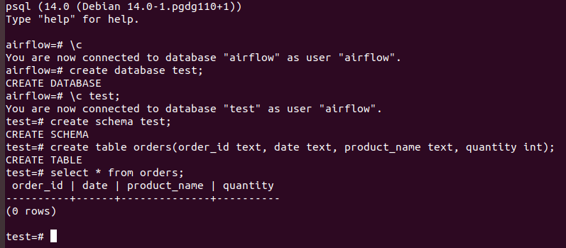
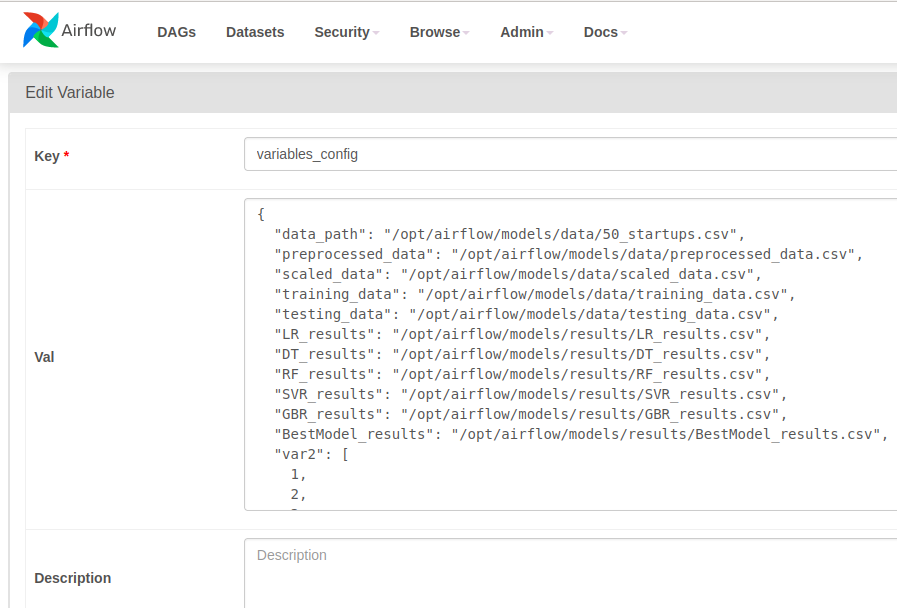
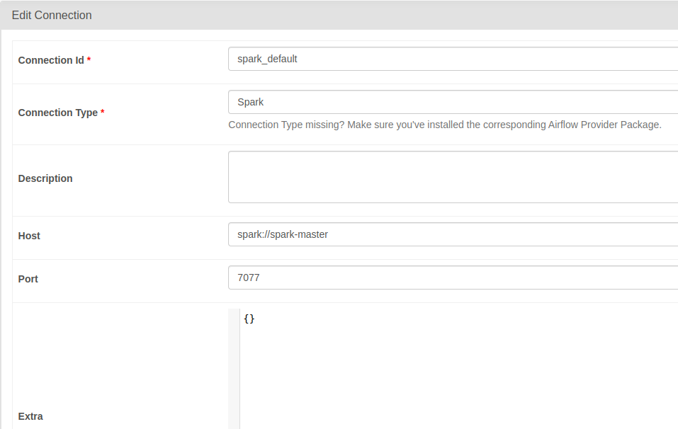
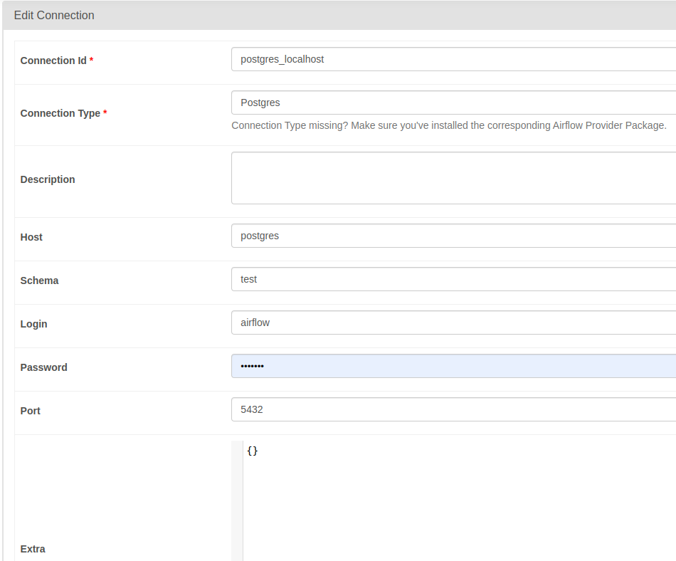
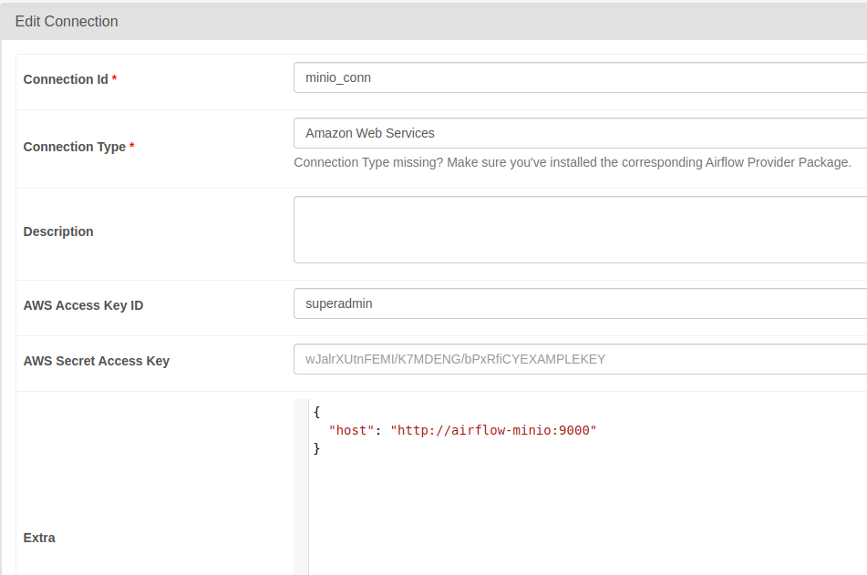

## Data Mining - Deep dive into Big Data


### Airflow + Spark cluster

## docker-airflow-spark

Docker with Airflow + Postgres + Spark cluster + JDK (spark-submit support) + Jupyter Notebooks

### 📦 The Containers

- **airflow-webserver**: Airflow webserver and scheduler, with spark-submit support.
    - image: `hoangph3/airflow:2.6.3-extend` (custom, Spark version 3.4.1)
        - Based on [apache/airflow:2.6.3-python3.8](https://hub.docker.com/r/apache/airflow), and [puckel/docker-airflow](https://github.com/puckel/docker-airflow)
    - port: 8080
- **postgres**: Postgres database, used by Airflow.
    - image: `postgres:14.0`
    - port: 5432
- **spark-master**: Spark Master.
    - image: `hoangph3/spark:3.4.1`
    - port: 8081
- **spark-worker[-N]**: Spark workers (default number: 1). Modify docker-compose.yml file to add more.
    - image: `hoangph3/spark:3.4.1`

### 🛠 Setup

#### Build airflow and spark Docker

```
$ make build_airflow build_spark
```

#### Launch containers

```
$ docker-compose up -d
```

#### Check accesses

- Airflow: http://localhost:8080
- Spark Master: http://localhost:8181

### 👣 Additional steps

#### Create `test` database in postgres:

- Jump into postgres container: `docker exec -it airflow-postgres psql -U airflow`.
- In container, execute the following command line to create database:



- Copy data into postgres: `docker cp data/ airflow-postgres:/data`
- Run `python3 psql_client.py` to insert data into orders table.

#### Add airflow variables

- Go to Airflow UI > Admin > Variables
- Upload variables json file.



#### Edit connection from Airflow to Spark

- Go to Airflow UI > Admin > Edit connections
- Edit `spark_default` entry:
    - Connection Type: `Spark`
    - Host: `spark://spark-master`
    - Port: `7077`



- Edit `postgres_localhost` entry:
    - Connection Type: `Postgres`
    - Host: `postgres`
    - Schema: `test`
    - Login: `airflow`
    - Password: `airflow`
    - Port: `5432`



- Edit `minio_conn` entry:`{
  "host": "http://airflow-minio:9000"
}
`
    - Connection Type: `Amazon Web Services`
    - AWS Access Key ID: `superadmin`
    - AWS Secret Access Key: `secretpassword`
    - Extra:



#### Test spark-submit from Airflow

Go to the Airflow UI and run the `tutorial_spark_submit_operator` DAG :)

#### Test postgres operator from Airflow

Go to the Airflow UI and run the `tutorial_postgres_hooks` DAG :)

#### Test ml pipeline from Airflow

Go to the Airflow UI and run the `tutorial_ml_simple_pipeline` DAG :)

### Kafka cluster

## Deploying kafka cluster kubernetes

1. Deploy kafka broker:

```sh
NAMESPACE="kafka"

# create and select a new namespace
$ kubectl create ns $NAMESPACE
$ kubectl config set-context --current --namespace="$NAMESPACE"

# deploy the Strimzi operator
$ kubectl create -f strimzi-cluster-operator-0.31.1.yaml

# deploy the Kafka cluster with external accessing
$ kubectl apply -f kafka-ephemeral.yaml
kafka.kafka.strimzi.io/ephemeral-cluster created

$ kubectl get pods
NAME                                                 READY   STATUS    RESTARTS   AGE
ephemeral-cluster-entity-operator-776554c699-h522h   3/3     Running   0          29s
ephemeral-cluster-kafka-0                            1/1     Running   0          57s
ephemeral-cluster-zookeeper-0                        1/1     Running   0          82s
strimzi-cluster-operator-54cb64cfdd-kbndn            1/1     Running   0          2m36s

# list service kafka
$ kubectl get svc
NAME                                         TYPE        CLUSTER-IP       EXTERNAL-IP   PORT(S)                      AGE
ephemeral-cluster-kafka-bootstrap            ClusterIP   10.102.159.187   <none>        9091/TCP                     73s
ephemeral-cluster-kafka-brokers              ClusterIP   None             <none>        9090/TCP,9091/TCP            73s
ephemeral-cluster-kafka-external-0           NodePort    10.111.197.45    <none>        9092:32000/TCP               73s
ephemeral-cluster-kafka-external-bootstrap   NodePort    10.103.113.162   <none>        9092:32100/TCP               73s
ephemeral-cluster-zookeeper-client           ClusterIP   10.99.29.241     <none>        2181/TCP                     99s
ephemeral-cluster-zookeeper-nodes            ClusterIP   None             <none>        2181/TCP,2888/TCP,3888/TCP   99s

# switch to default namespace
$ kubectl config set-context --current --namespace=default
```

1. Create kafka topics:

```sh
$ kubectl apply -f kafka-topics.yaml
kafkatopic.kafka.strimzi.io/test-topic created
```

1. Get the address of kafka broker:

```sh
$ kubectl get svc -n kafka ephemeral-cluster-kafka-external-bootstrap -o jsonpath -o=jsonpath='{.spec.clusterIP}:{.spec.ports[0].port}'
10.103.113.162:9092
```

1. Testing:

```sh
# Send data
python3 kafka-client.py --command produce
100%|██████████| 100/100 [00:00<00:00, 18429.21it/s]

# Read data
python3 kafka-client.py --command consume
{'test-topic', '__strimzi-topic-operator-kstreams-topic-store-changelog', '__strimzi_store_topic'}
{'data': 95}
{'data': 96}
{'data': 97}
...
```

### Spark cluster

## Spark Cluster with Docker

A simple spark standalone cluster for your development environment.

| Container | Exposed ports |
| --- | --- |
| spark-master | 9090 |
| spark-worker-1 | 9091 |
| spark-worker-2 | 9092 |
| my-postgres | 5432 |

### Installation

#### 1. Build the image

```sh
make build
```

#### 2. Run the spark cluster

```sh
make start
```

#### 3. Validate your cluster

Accessing the spark UI:

- [Spark Master](http://localhost:9090)
- [Spark Worker 1](http://localhost:9091)
- [Spark Worker 2](http://localhost:9092)

### Resource Allocation

- The default CPU cores allocation for each spark worker is 1 core.
- The default RAM for each spark worker is 1024MB.
- The default RAM allocation for spark executors is 256MB.
- The default RAM allocation for spark driver is 128MB.
- If you wish to modify this allocations just edit the env/spark-worker.sh file.

### Run sample jobs

Connect to one of the workers or the master:

```sh
docker exec -it spark-worker-1 bash
```

Then execute:

```sh
/opt/spark/bin/spark-submit --master spark://spark-master:7077 \
--jars /opt/spark/examples/postgresql-42.5.1.jar \
--driver-memory 1G \
--executor-memory 1G \
/opt/spark/examples/main.py
```

Verify the database:

```
psql -h localhost -U admin -d my_db
Password for user admin: ******

my_db=# \dt
         List of relations
 Schema |   Name    | Type  | Owner 
--------+-----------+-------+-------
 public | starbucks | table | admin
(1 row)

my_db=# select * from starbucks;
         name          |  size  | price |     sale_price     
-----------------------+--------+-------+--------------------
 White Chocolate Mocha | Tall   |  3.75 |              3.375
 White Chocolate Mocha | Grande |  4.45 |              4.005
 White Chocolate Mocha | Venti  |  4.75 |              4.275
 Cinnamon Dolce Latte  | Tall   |  3.65 |              3.285
 Cinnamon Dolce Latte  | Grande |  4.25 |              3.825
 Cinnamon Dolce Latte  | Venti  |  4.65 | 4.1850000000000005
 Caramel Macchiato     | Tall   |  3.75 |              3.375
 Caramel Macchiato     | Grande |  4.45 |              4.005
 Caramel Macchiato     | Venti  |  4.75 |              4.275
(9 rows)
```

You can get full source code here: [data-pipeline](https://github.com/hoangph3/mlops-labs/tree/main/data-pipeline), [airflow-spark](https://github.com/hoangph3/mlops-labs/tree/main/data-pipeline/airflow-spark), [kafka-cluster](https://github.com/hoangph3/mlops-labs/tree/main/data-pipeline/kafka-cluster), [spark-cluster](https://github.com/hoangph3/mlops-labs/tree/main/data-pipeline/spark-cluster).
